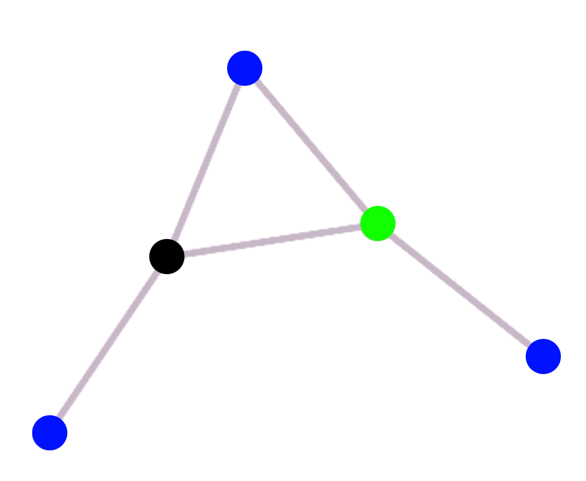
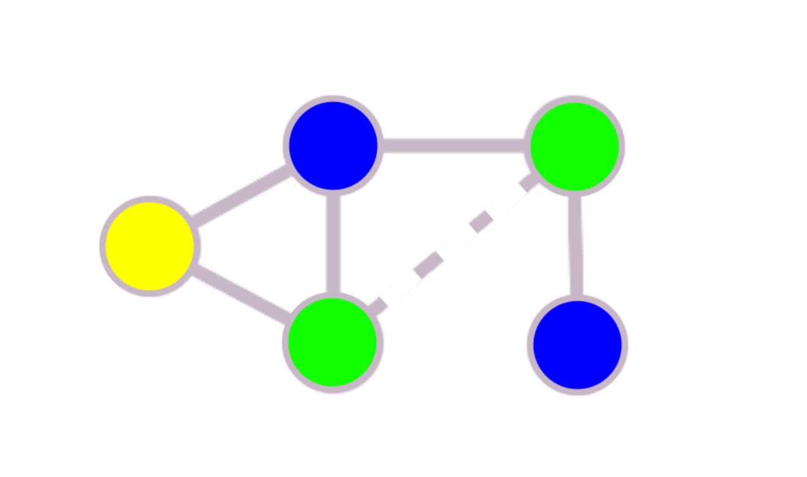
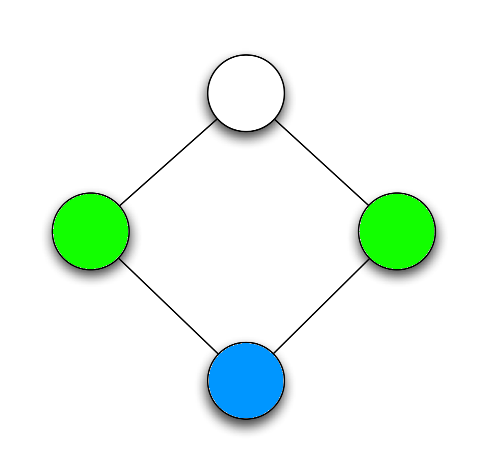
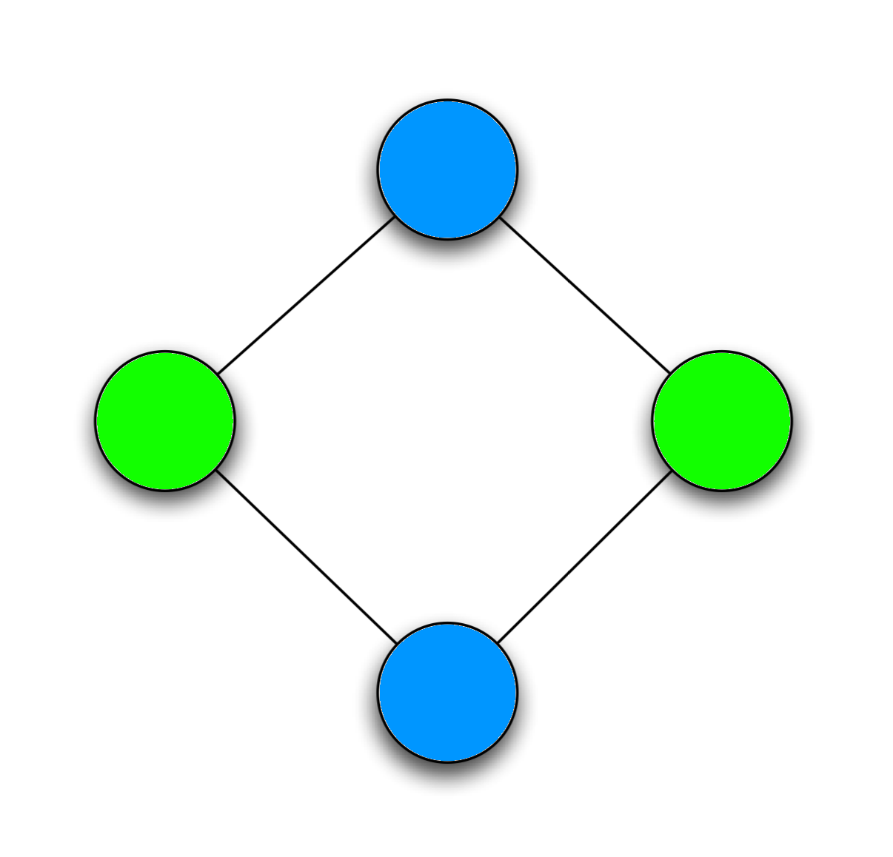

# ChaitinAlgorithm
Chaitin Algorithm in Java

## What's Chaitin Algorithm ?!

Chaitin algorithm is used to **colour any graph**.

This program contains 3 classes : Graph, Vertex and Edge.
You can create your graph and use colorGraph to colour your graph. You need to create
three arraylist with Vertex, Interference Edge and Preference Edge.

You can see simple examples in the main method in Main class.

### Three different tests

1. **Common Graph**  

      

      *Common version*

2. **Graph with preference link**

      

     *Graph with preference link (dotted line)*

3. **Graph with "spill" : First print will show the pessimistic version of the algorithm, and second one will show optimistic version.**

      

      *Pessimistic version*

      

      *Optimistic version*
