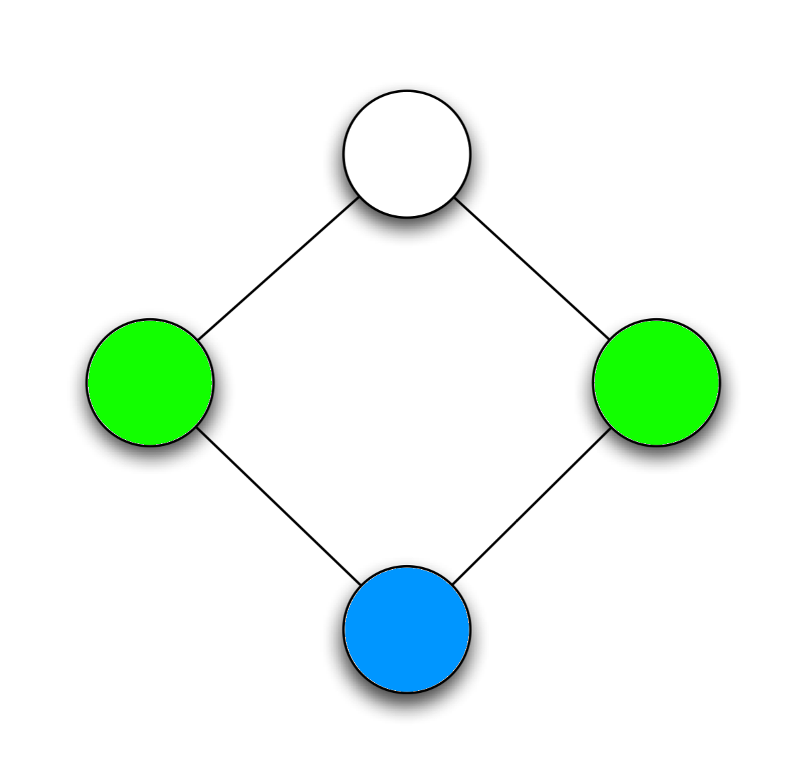
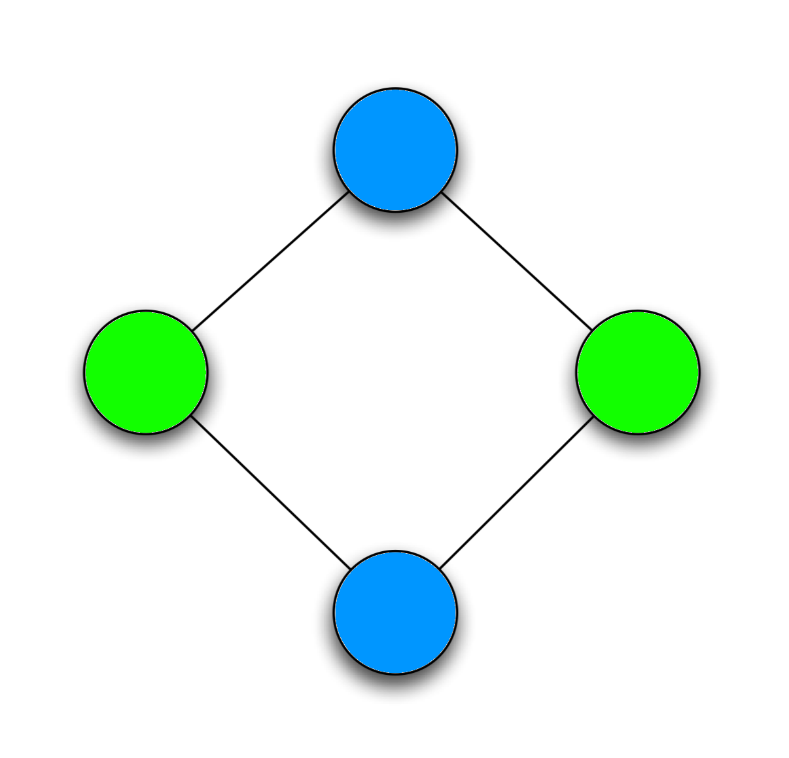

# ChaitinAlgorithm
Chaitin Algorithm in Java

Three different tests

1. Common Graph
2. Graph with preference link
3. Graph with "spill" : First print will show the pessimistic version of the algorithm, and second one will show optimistic version.

# Chaitin Algorithm ?!

Chaitin algorithm is used to colour any graph.
